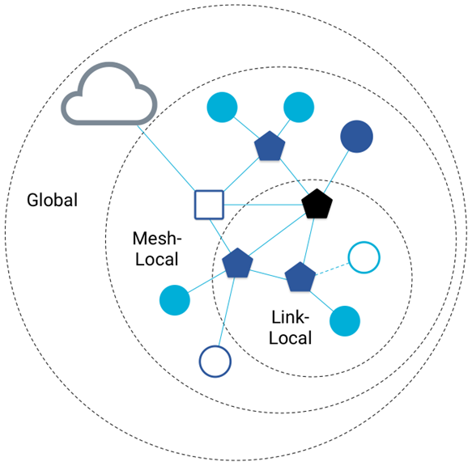
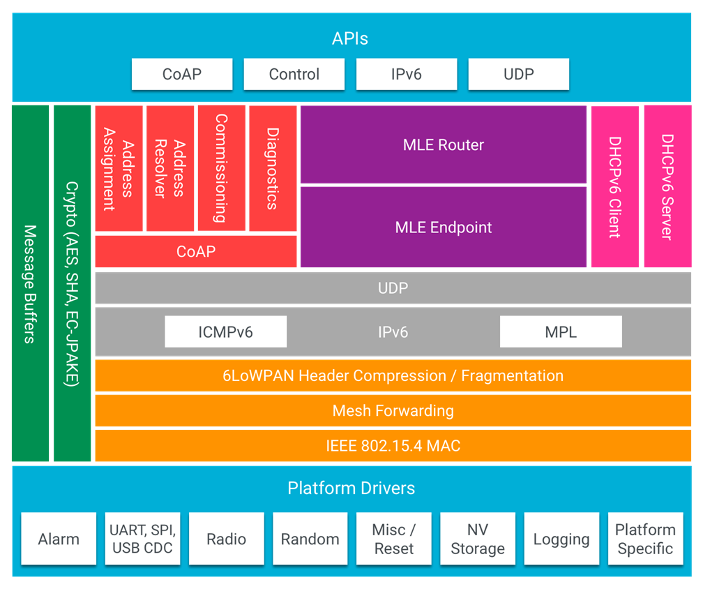
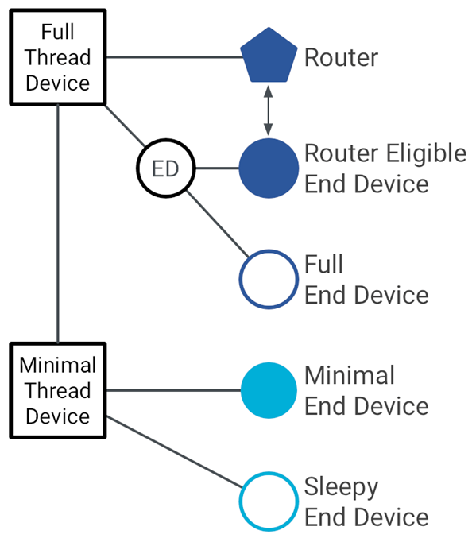
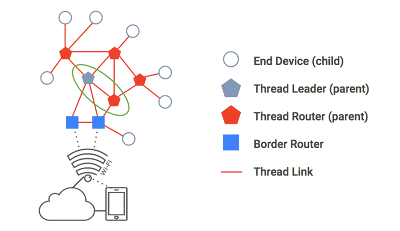
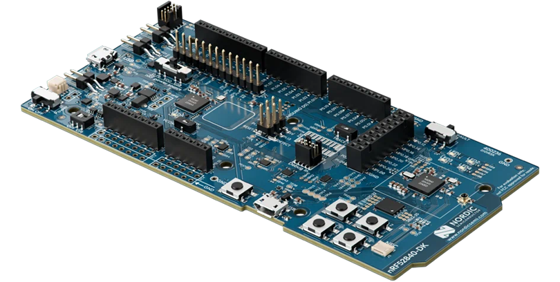

# Project Report 
* Pashiourtides Costas
* Interoperability Dynamic analysis  for Open Thread  

## Content
* OpenThread Protocol Overview
* Suggested Framework 
* Implementation and failures 
* Future work 

The project had as its goal to explore dynamic interoperability analysis techniques by interacting with the OpenThread protocol in a controlled simulation environment. It aimed to evaluate how well OpenThread maintains stable communication and routing under changing network conditions. This investigation served as a foundation for assessing the protocol’s future applicability in CPS and IIoT systems within critical infrastructure networks (CNI).

---
#  OpenThread Protocol Overview

OpenThread introduces a modern, IPv6-based mesh networking protocol built on the IEEE 802.15.4 standard, optimized for low-power, resource-constrained devices. Its unique architecture combines 6LoWPAN compression, RPL routing, and UDP/CoAP communication to ensure secure, scalable, and resilient communication in decentralized IoT networks. With native support for role-based topology (Leader, Router, End Device) and features like automatic mesh self-healing, OpenThread enables highly dynamic and efficient wireless networks—distinguishing between Full Thread Devices (FTDs), which can route and maintain network structure, and Minimal Thread Devices (MTDs), which rely on parent nodes for connectivity.

--- 
# Suggested Framework 

The suggested framework proposes a structured methodology for conducting interoperability dynamic analysis of IoT protocols, with a specific focus on OpenThread. This framework is designed to evaluate how well a Thread-based mesh network sustains communication reliability, protocol correctness, and operational stability when subjected to dynamic conditions. By organizing the analysis into clearly defined experimental phases, it enables a systematic examination of both steady-state behavior and network responses to changes, such as node additions or role transitions.

The core evaluation goals of this framework are to determine whether the OpenThread mesh network can maintain interoperability and consistent performance during scenarios involving scaling or shifting node roles. Key questions include: Does the network maintain communication and routing reliability as it grows or contracts? How quickly does the network converge after initialization or dynamic change? Can the system remain stable under stress, and at what point do failures begin to occur? To address these questions, a set of specific metrics is captured in sequence during each experimental phase—ensuring clarity and repeatability in the analysis.

The experiment process is divided into three stages. In the **Baseline phase**, the network is first stabilized and essential metrics such as leader election time, routing convergence, and packet delivery ratio are recorded. During the **Scale-Up phase**, additional nodes are introduced to observe how the network adapts to growth, measuring performance indicators like RPL update efficiency and multicast propagation delay. Finally, in the **Role Change/Scale-Down phase**, devices are removed or demoted to evaluate how the protocol handles role transitions and shrinking topologies. Metrics are continuously captured throughout these transitions to assess protocol resilience and detect performance degradation or failure thresholds.

## Metrics explanation and order 
1. Leader Election Phase 
2. Topology Convergence 
3. RPL Route Stability & Update Efficiency
4. Multicast Propagation Delay (MPD)
5. Packet Delivery & Communication & IPv6 Packet Forwarding Efficiency
6. 6LoWPAN Compression Efficiency

### 1. Leader Election Phase 
* Goal: Ensure that the network successfully elects a single Leader and all nodes establish a stable initial role.
* Output: Confirmation of one Leader, valid node roles, and consistent addressing with no routing instability.

#### Step 1: Attach Status Check
Verify that all nodes are properly attached (i.e., not detached or disabled) and have joined the mesh.

####  Step 2: Single Leader Verification
Confirm that exactly one node assumes the Leader role to maintain topology control.

####  Step 3: Valid Roles Across Nodes
Ensure all non-Leader nodes are either Routers or Children, with no undefined roles.

####  Step 4: RLOC16 Stability
Check that short addresses (RLOC16) assigned to nodes remain unchanged during stabilization.

####  Step 5: IPv6 Address Stability
Confirm that IPv6 address lists for each node remain consistent once roles are assigned.

####  Step 6: State Stability
Ensure that node roles (Leader, Router, Child) do not change over time once the network stabilizes.

####  Step 7: Routing Message Silence
Monitor logs to confirm the absence of frequent DIO/DAO messages, indicating routing has settled.

### 2. Topology Convergence 
* Goal: Validate that the routing and neighbor tables have stabilized across the mesh network.
* Output: All nodes share consistent neighbor and router tables, and mesh-wide reachability is confirmed.

####  Step 8: Neighbor Table Stability
Check that each node’s neighbor table remains constant over time.

####  Step 9: Router Table Stability
Confirm that all router tables across nodes contain consistent entries.

####  Step 10: Prefix & Route Propagation
Ensure that all routing prefixes and advertised routes are identical and stable across nodes.

####  Step 11: End-to-End Reachability
Verify that every node can ping all others using mesh-local IPv6 addresses.

### 3. RPL Route Stability & Update Efficiency
* Goal: Assess how consistently routing paths are maintained and how quickly control messages decay.
* Output: Stable route tables with minimal DIO/DAO traffic after convergence.

#### Step 12: Route Table Snapshot Stability
Take snapshots of routing tables at intervals (e.g., every 10s) and verify consistency over time.

####  Step 13: DIO/DAO Message Decay Time
Measure how quickly routing updates cease after convergence, revealing Trickle algorithm effectiveness.

### 4.  Multicast Propagation Delay (MPD)
* Goal: Measure the speed of multicast message propagation across the network.
* Output: Delay per node and overall max propagation time for control messages.

#### Step 14: Multicast Trigger
Initiate a multicast DIO/DAO message from a chosen node and log the exact send timestamp.

#### Step 15: Reception Logging
Record the first time each node receives the multicast message.

#### Step 16: Compute MPD
Calculate the propagation delay per node and report the maximum value as the MPD.

### 5. Packet Delivery & Communication & IPv6 Packet Forwarding Efficiency

* Goal: Evaluate packet delivery success, forwarding reliability, and the efficiency of IPv6 routing.
* Output: Metrics such as Packet Delivery Ratio (PDR), hop counts, and transmission efficiency.

##### Step 17.1: Identify Node Pairs for Communication
Select node pairs from different role combinations (L→R, L→C, R→R, R→C, etc.) covering ~30% of the network.

##### Step 17.2: Send CoAP Echo Requests
Perform repeated CoAP message transmissions between selected node pairs.

##### Step 17.3: Collect and Parse Logs
Use OTNS logs or CLI to track sent and received packets, along with routing paths.

##### Step 17.4: Compute Packet Delivery Ratio (PDR) and Loss Rate (PLR)
Calculate success and failure rates from total sent vs. received packets.

##### Step 17.5: Compute Forwarding Success Rate
Measure how efficiently packets are forwarded, hop-by-hop, to the destination.

##### Step 17.6: Calculate Total Transmissions
Tally hop-level transmissions for all successful deliveries.

##### Step 17.7: Compute IPv6 Packet Forwarding Efficiency
Determine how efficiently packets traverse the mesh:

$$
\text{Efficiency (\%)} = \left( \frac{\text{Packets Received}}{\text{Total Transmissions}} \right) \times 100
$$

### 6. 6LoWPAN Compression Efficiency
#####  Step 19.1: Capture 6LoWPAN Packet Sizes (after Step 17)
After CoAP tests (Step 17), extract relevant packets (port 5683) from lowpan.pcap.

##### Step 19.2: Compare Raw vs. Compressed Headers
Compare compressed header size to uncompressed baseline (48 bytes for IPv6 + UDP).

##### Step 19.3: Analyze Compression Behavior by Topology
Group results by communication roles (e.g., L→R, R→C) to identify patterns and inefficiencies.

--- 
# Implementation and Failures  

**The initial idea was** to build a multi-container Docker network, where each container would emulate a device supported by OpenThread (e.g., Nordic Semiconductor nRF52840), running ZephyrOS with an OpenThread node on top.

## What Failed and What Was Tested
Turing the initial phase of the project, multiple approaches were tested to simulate a realistic OpenThread network environment using software emulation and containerization. The first attempt involved creating a multi-container Docker setup, where each container would act as an independent OpenThread node. However, this approach failed due to inter-container communication issues — even with proper commissioning keys, nodes were unable to discover each other or form a mesh network. A second attempt focused on using ZephyrOS to build firmware for supported devices, but repeated build and runtime issues blocked CLI access or proper network initialization. Emulating OpenThread-capable hardware, such as the Nordic nRF52840, through tools like Renode also failed due to hardware-specific configuration mismatches and incomplete board support. Lastly, running multiple simulated nodes inside a single WSL instance proved problematic due to limitations in virtual networking, especially when relying on multicast or low-level packet handling required by OpenThread.

## What worked : OTNS  & what was the limmitations 

After encountering repeated failures with containerized and emulated setups, the project pivoted to using OTNS (OpenThread Network Simulator) — the official simulation framework developed by the OpenThread team. OTNS provided a stable and functional environment where multiple nodes could be launched, controlled, and monitored in real time using the `ot-cli-ftd` binary. The simulation reliably supported mesh formation, role transitions, and basic communication scenarios, making it an effective platform for implementing and evaluating the interoperability metrics framework.

However, OTNS also presented some important limitations. First, there was no built-in method to directly access or query the internal simulation clock, making precise time-based analysis (e.g., propagation delay measurements) difficult without extensive log parsing. Second, the CLI exposed to each simulated node supported only a limited subset of commands — 24 commands instead of the full 112 supported by the actual OpenThread CLI — which restricted access to low-level debugging or detailed packet inspection. Finally, although multicast messages could be triggered and observed in logs, accurately capturing per-node multicast propagation delay was not feasible due to the lack of synchronized timestamps across node outputs and the absence of packet-level hooks or events within OTNS.

---

# Conclusions 

In conclusion, the shift to OTNS allowed the project to overcome early technical roadblocks and successfully implement the core phases of the interoperability testing framework within a simulated OpenThread environment. It provided a controlled setup for observing network formation, role transitions, and protocol behavior without requiring physical hardware or complex emulation layers. This proved especially useful for prototyping and validating the sequence of metrics defined in the framework, helping to build confidence in the experiment design and simulation control logic.

Despite the stability offered by OTNS, collecting measurement data for meaningful comparison was ultimately limited in value due to the simulator’s constraints. The inability to access precise simulation time made it difficult to quantify timing-based metrics such as propagation delays, convergence durations, or message decay intervals with accuracy. Additionally, the reduced CLI command set restricted visibility into internal routing, packet-level details, and node statistics, limiting the depth and fidelity of data that could be captured. As a result, while qualitative observations were possible, quantitative comparisons between scenarios or against real hardware behavior lacked the granularity and precision required for rigorous analysis.

---
# Future Plans 

Looking ahead, the next phase of the project will focus on achieving full device emulation of OpenThread nodes in a multi-container network architecture. Each node will run inside its own Docker container, enabling modular simulation and isolated debugging. The containers will be equipped with a Renode-based emulation of the Nordic nRF52840 DK board, using Zephyr OS as the RTOS. On top of Zephyr, the OpenThread stack will operate as the Layer 2 network component, supporting key IoT protocols such as Thread, 6LoWPAN, RPL, CoAP, and IPv6.

This advanced setup will allow for a richer and more realistic analysis of interoperability under complex network conditions. In particular, it will enable controlled experimentation with dynamic scaling (adding nodes) and role transitions (e.g., Router ↔ End Device), helping to assess protocol resilience, convergence behavior, and routing consistency under stress. The ability to observe low-level interactions in a full emulation stack is expected to unlock new insights that were not possible in OTNS alone.

Finally, a long-term goal of this research is to evaluate the suitability of OpenThread in industrial IoT (IIoT) and critical infrastructure (CNI/CPS/OT) environments. By validating OpenThread’s performance and flexibility in emulated control system topologies, this work aims to inform future deployment strategies for secure, scalable, and standards-compliant wireless industrial networks.

# References 
[1] OpenThread Documentation - https://openthread.io  
[2] OTNS Simulator - https://github.com/openthread/ot-ns
